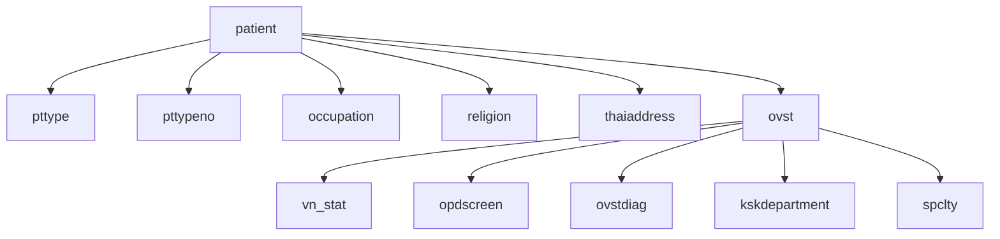

# HOSxP — Used by 900+ Hospitals Nationwide

A collection of SQL scripts for BMS-HOSxP data extraction and analysis, developed without ER diagrams or documentation.

---

## Project Highlights & Challenges

* **Reverse Engineering:** Built without ER diagrams or existing database documentation. Table relationships and data structures were identified through hands-on analysis of the HOSxP system and existing SQL queries.
* **Data Privacy:** Includes data-masking implementations to help protect sensitive Patient Identifiable Information (PII) during development and testing.
* **Data Migration:** Includes scripts for extracting and transforming legacy hospital data for use in secondary applications such as **Buddy care** is a cloud-based healthcare platform by MOPH.

---

## Available SQL Scripts

| Script Name | Purpose & Description |
| :--- | :--- |
| `check_daily_patient.sql` | Tracks and counts patients who received medical services on a specific date. |
| `check_service_cost.sql` | Retrieves patient service costs and total medical expenses. |
| `dtx_export.sql` | Extracts DTX records for dental department reporting. |
| `masked_patient.sql` | **[Security]** Demonstrates data-masking techniques for protecting patient information. |
| `migration_patient_data.sql` | Transforms and migrates patient demographics and clinical records to **Buddy care** is a cloud-based healthcare platform by MOPH. |
| `telemedicine_export.sql` | Filters and exports patients who received telemedicine services. |
| `view_allergy_history.sql` | Retrieves historical drug allergy information for patients. |
| `view_village.sql` | Retrieves patient village and geographic information. |

---

## Database Schema Overview

Key HOSxP tables used by these SQL scripts include:

### 1. Patient Demographics & Rights

* `patient` — Core repository for general patient information.
* `pttype` / `pttypeno` — Healthcare entitlement and insurance information.
* `occupation` / `religion` / `thaiaddress` — Additional demographic information.

### 2. Outpatient Department (OPD)

* `ovst` — Patient visit information.
* `vn_stat` — Visit-related clinical and service cost information.
* `opdscreen` — Patient screening and initial assessment information.
* `ovstdiag` — Patient diagnosis information.
* `kskdepartment` / `spclty` — Service points, clinics, and medical specialties.

---

## Database Relationship Graph

The following graph provides a simplified overview of how selected HOSxP tables are used together in these SQL scripts.

